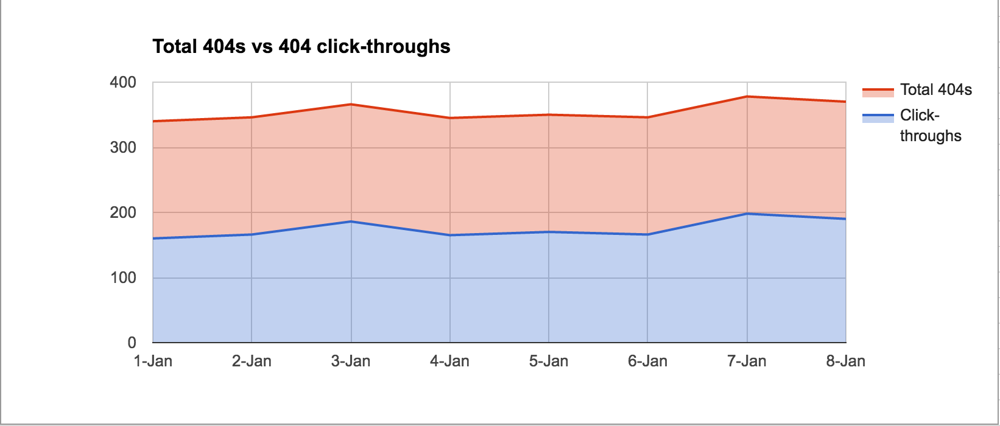

# METRICS

**We are unable to use our existing Telemetry system to record metrics data
from FirefoxNoMore404s.**  See [issue 433](https://github.com/mozilla/testpilot/issues/433)
for details.  That means the "how" part of this document might change, but the
  "what" part should be pretty accurate.

## Data Analysis
The collected data will primarily be used to answer the following questions.
Images are used for visualization and are not composed of actual data.

### Do people want to use this?

What is the overall usage of FirefoxNoMore404s?  **This is the standard Daily Active User
(DAU) and Monthly Active User (MAU) analysis.**  This captures people who have
the add-on installed, regardless of whether they are actively using it.


On pages which are 404s, how often does the user follow the link to the
Internet Archive?




### Additional interesting questions

* How often are 404s hit and a positive match is not made from the Internet
  Archive?
  * This can be answered from server-side logging.
* What is the number of 404s a person hits in a browsing session?
  * This will need to be reviewed by the privacy team before we could start
    logging the data.


## Data Collection

### Server Side
FirefoxNoMore404s has a server side component hosted by the Internet Archive.
They will collect regular usage and website health statistics.  Review their
[Terms of Service and Privacy Policies](https://archive.org/about/terms.php).

### Client Side
Presumably hitting a 404 online is an unusual occourance so FirefoxNoMore404s
will ping Test Pilot immediately and not batch up any data.  A ping is sent
when:

* A user hits a 404 and there is not an archived version available
* A user hits a 404, chooses to click through to the archived version
* A user hits a 404, chooses to dismiss the archive version prompt
* A user hits a 404, does not interact with the prompt, and navigates away or
  closes the tab

TODO -- this part is still under construction

The `action` below is one of:
* 'viewed':  the user clicked through to the archived version
* 'dismissed': the user dismissed the prompt
* 'ignored': the user ignored the prompt
* 'none': will be 'none' if there isn't an archive available

Here's an example of the `payload` portion of a Test Pilot telemetry ping:

```js
{
  "test": "Wayback Machine",         // The name of the add-on
  "agent": "User Agent String",
  "payload": {
    "action": "viewed",              // See full list above
    "archive_available": true
  }
}
```

A Redshift schema for the payload:

```js
local schema = {
--   column name                   field type   length  attributes   field name
    {"timestamp",                  "TIMESTAMP", nil,    "SORTKEY",   "Timestamp"},
    {"uuid",                       "VARCHAR",   36,      nil,         get_uuid},

    {"test",                       "VARCHAR",   255,     nil,         "Fields[test]"},

    -- Parsed automatically from the `agent` field
    {"user_agent_browser",         "VARCHAR",   255,     nil,         "Fields[user_agent_browser]"},
    {"user_agent_os",              "VARCHAR",   255,     nil,         "Fields[user_agent_os]"},
    {"user_agent_version",         "VARCHAR",   255,     nil,         "Fields[user_agent_version]"},

    {"action",                     "VARCHAR",   255,     nil,         "payload[action]"},
    {"archive_available",          "VARCHAR",   255,     nil,         "payload[archive_available]"}
}
```

Note that Mozilla is *not* recording which pages are 404s, however, the Internet
Archive must have that information to look up if they have an archived version.

All Mozilla data is kept by default for 180 days.
